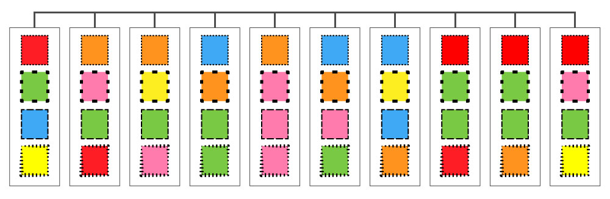
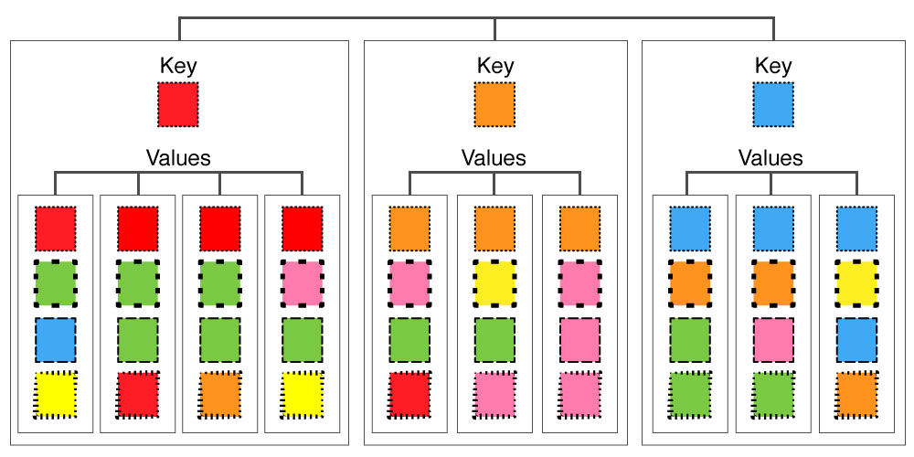

# Nests

Nesting in D3 refers to creating hierarchical objects from arrays containing objects with matching property names. The nest method creates key-value pairs by grouping elements in an array by a given property, returning an array of hierarchical objects. By supplying multiple properties, it is possible to create tree structures with many levels of keys.

An initialized nest method is called a *nest operator* because it performs operations on data, similar to arithmetic operators. A nest operator does not retain any reference to data it has nested and it can be reused with different data inputs. The only information stored in the nest operator are the keys and other methods used to define how objects should be nested.

Nests are an extremely useful feature in D3 for analyzing and manipulating data. Objects are commonly nested so that the new hierarchy can be iterated through, such as in drawing methods. You can also create nest operators to sort the data by keys or leaves, and to calculate summary data using the rollup method.

**Example**

Consider an array with ten elements, each containing an object that has four properties:



Here the properties are shown by different border styles, and their contents as colors. If we were to nest this array by registering the small dotted border as a key, the resulting nested object would look like the following:



Now the elements are nested by the value of the small dot key. There are three keys, from the three unique values of the dot property. Each key has an array of elements that contain a dot property with a value mactching the key. Notice that the ten elements from the original array have not changed, only they been reorganized into the new key-value hierarchy.

Here's the same process again, but with Javascript. Start with an array containing ten elements, each containing an object that has four properties:

```javascript
var colors = [
	{dot: "red", block: "green", dash: "blue", wave: "yellow"},
	{dot: "orange", block: "pink", dash: "green", wave: "red"},
	{dot: "orange", block: "green", dash: "blue", wave: "yellow"},
	{dot: "blue", block: "orange", dash: "green", wave: "green"},
	{dot: "orange", block: "pink", dash: "pink", wave: "pink"},
	{dot: "blue", block: "orange", dash: "pink", wave: "green"},
	{dot: "blue", block: "yellow", dash: "blue", wave: "orange"},
	{dot: "red", block: "green", dash: "green", wave: "red"},
	{dot: "red", block: "green", dash: "green", wave: "orange"},
	{dot: "red", block: "pink", dash: "green", wave: "yellow"}
];
```

Then, in nested form using the dot property as a key:

```javascript
[
	{key: "red", values: [{dot: "red", block: "green", dash: "blue", wave: "yellow"}, {dot: "red", block: "green", dash: "green", wave: "red"}, {dot: "red", block: "green", dash: "green", wave: "orange"}, {dot: "red", block: "pink", dash: "green", wave: "yellow"}]},
	{key: "orange", values: [{dot: "orange", block: "pink", dash: "green", wave: "red"}, {dot: "orange", block: "green", dash: "blue", wave: "yellow"}, {dot: "orange", block: "pink", dash: "pink", wave: "pink"}]},
	{key: "blue", values: [{dot: "blue", block: "orange", dash: "green", wave: "green"}, {dot: "blue", block: "orange", dash: "pink", wave: "green"}, {dot: "blue", block: "yellow", dash: "blue", wave: "orange"}]}
]
```

The following sections describe how to use d3.nest() to set up and transform arrays into nested objects.


## d3.nest()

**Description**

Creates a new nest operator with the following methods:

- entries
- key
- map
- object
- rollup
- sortKeys
- sortValues

The set of keys is initially empty, and you must assign them with the key method to nest data.

**Example**

```javascript
var nest = d3.nest();
```

Initializes a new nest operator and assigns it to the variable *nest*.


## nest.key(key)

**Parameters**

*key*: a callback function that returns a string used to identify groups.

**Description**

Registers a new key function in the nest operator. When the nest operator is used to create nested data with the entries method, the key function is invoked for each element in the input array. The key function uses a string identifier to organize the elements into groups. Most often, the function is an object property accessor returned by the key callback function.

It is possible to register multiple keys in a nest operator. Each time a key is registered, it is pushed onto the end of the internal array of keys. The order of keys is in reverse of how they are registered; the last key registered is at the top of the hierarchy.

> Note: if the string identifier does not match any property in an element of the array, that object will be appended to an *undefined* key group.

**Example**

Registering one key with a nest operator:

```javascript
nest.key(function(d) { return d.dot; });
```

Here the key method is passed a callback function that returns the value obtained from the property accessor *dot*.

Registering two keys with a nest operator:

```javascript
nest.key(function(d) { return d.dot; })
	.key(function(d) { return d.block; });
```

Here two key methods are chained together to register the *dot* and *block* property accessors as keys. The *block* key will be first in the hierarchy, then *dot*.


## nest.sortKeys(comparator)

**Parameters**

*comparator*: a callback function that defines the sort order, matching the [compareFunction](https://developer.mozilla.org/en-US/docs/Web/JavaScript/Reference/Global_Objects/Array/sort#Description) return values. D3 provides two sort order functions, *d3.ascending* and *d3.descending*.

**Description**

Sorts key values for the current registered key


**Example**